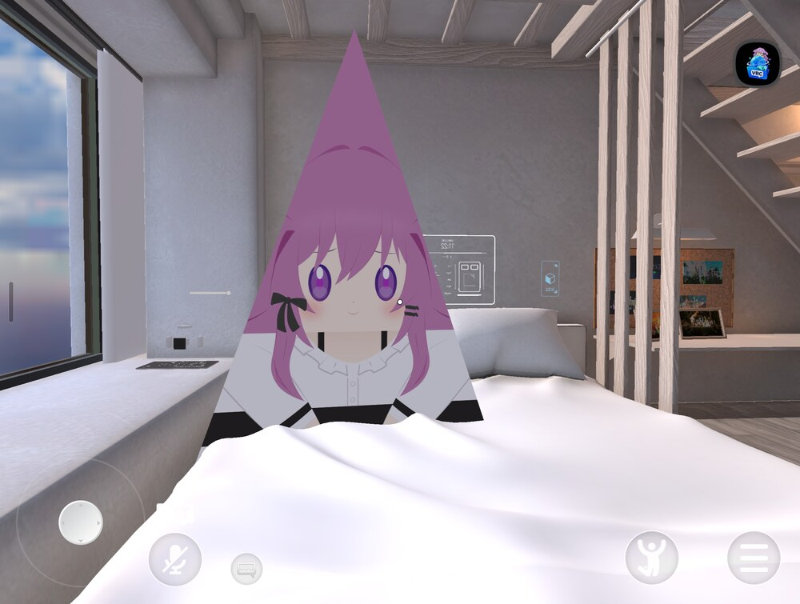
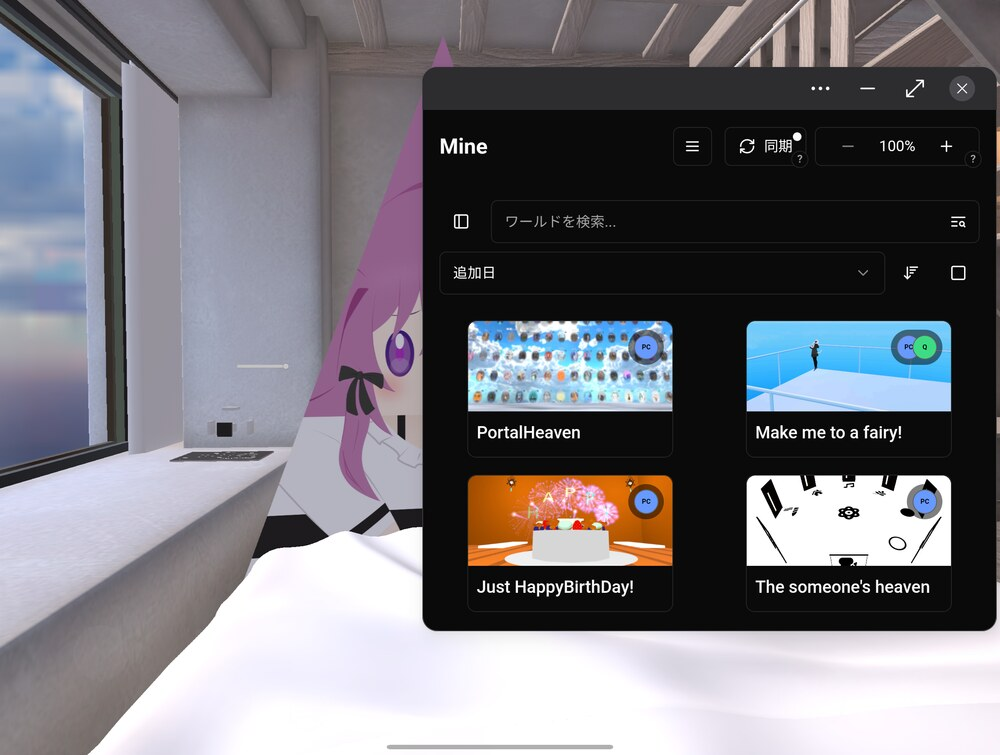
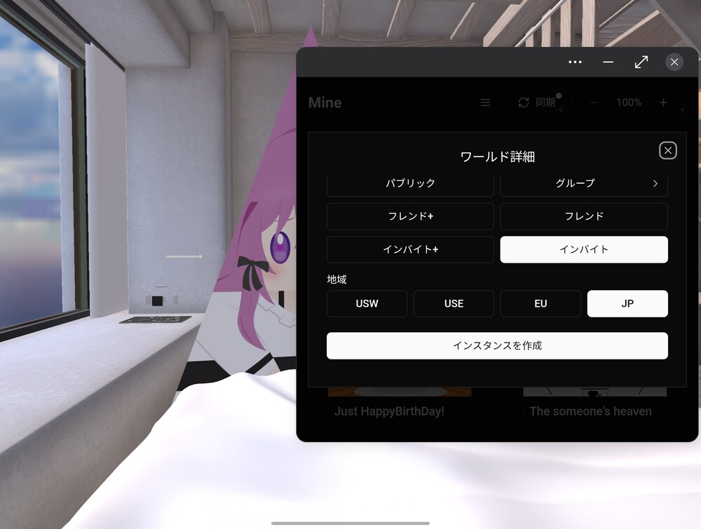
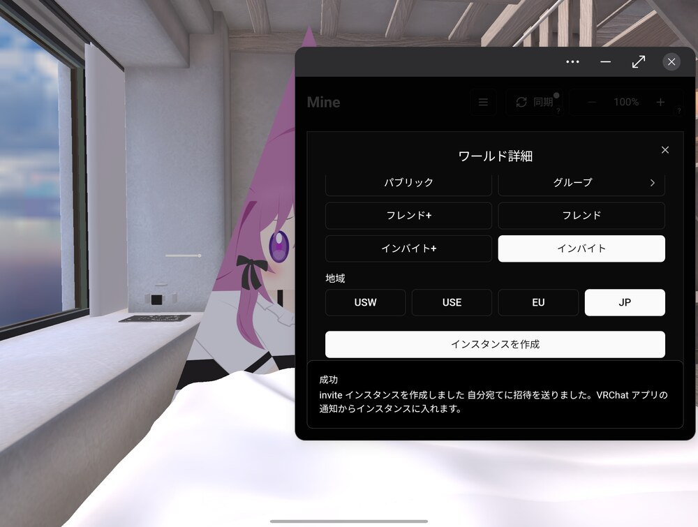
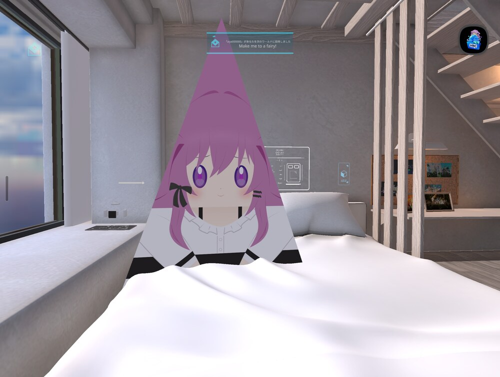
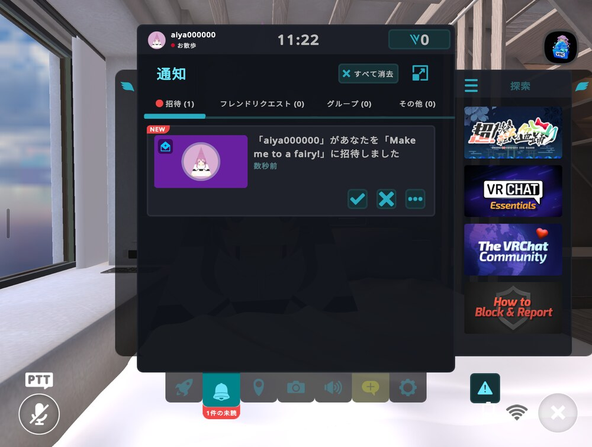
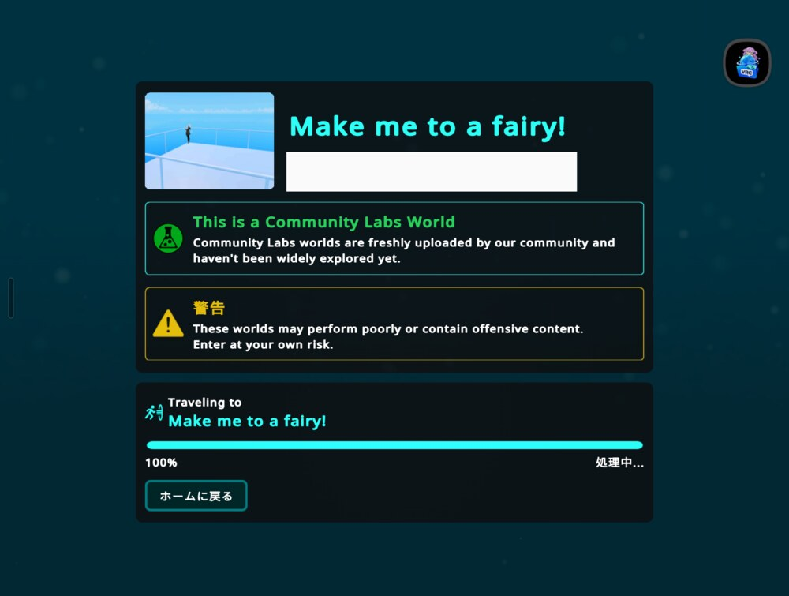
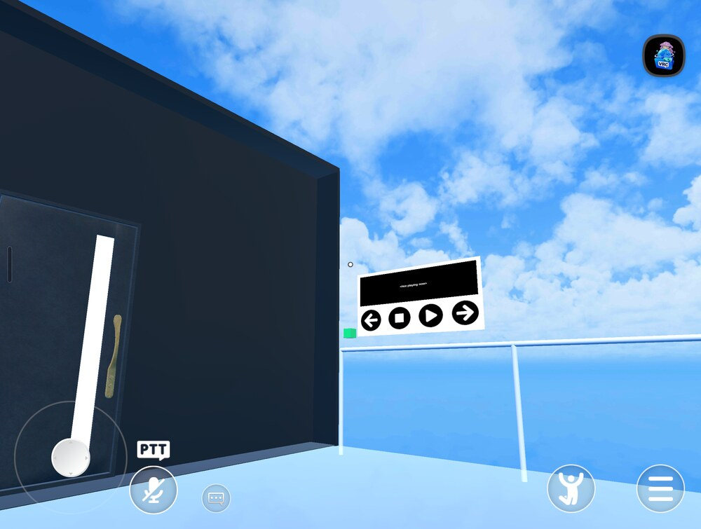

<div align="center">

# VRChat Worlds Manager Web (VRCWW)

\- [bɯi aːɾɯ ɕiː waɾawaɾa] \-

[](https://github.com/aiya000/VRC-Worlds-Manager-Web/actions/workflows/test.yml)
[](https://vrchat-worlds-manager-web.pages.dev)
[](https://bun.sh)

[日本語はこちら / 日本語のREADMEはREADME_JP.mdを参照してください。](./README_JP.md)

</div>

**VRChat Worlds Manager Web (VRCWW)** is a Progressive Web App (PWA) that helps VRChat users organize, store, and explore their favorite worlds. It is based on the original [VRC Worlds Manager v2](https://github.com/Raifa21/VRC-Worlds-Manager-v2) desktop application, rewritten to run entirely in modern web browsers, mobile devices, and VR overlays.

🌐 **Live Web App**: [https://vrchat-worlds-manager-web.pages.dev](https://vrchat-worlds-manager-web.pages.dev)

---

## Features

- **Web & PWA Ready (VR-First / Responsive Layout)**
  - Runs in any modern web browser on PC, smartphones, and VR overlays (XSOverlay, SteamVR browser, Quest browser, etc.).
  - Responsive layout with a collapsible sidebar and touch/laser-friendly controls.
  - Can be installed to your home screen or desktop as a Progressive Web App (PWA).
  - Usable as a desktop application, just as the original VRC Worlds Manager v2 is.
  - What you edit on the desktop -- adding favourites, sorting them into folders -- syncs to your phone and your other PCs. The same data everywhere, with no export or import step.

- **Add & Preserve Favourite Worlds**
  - Automatically fetch worlds marked as Favourites in VRChat via the API and store them in the app.
  - Saved worlds remain preserved even if removed from your VRChat Favourites list or if your slots are full.
  - Add worlds directly using URL links.

- **Organize Worlds into Folders & Customize Views**
  - Organize saved worlds into folders (a single world can belong to multiple folders).
  - Customize world card display with per-field visibility toggles.
  - Attach personal notes and memos to each world.

- **Multi-Account Support & Management Tools**
  - Import favourite worlds from another VRChat account into your folders.
  - Purge all VRChat favorites from an account in one click.

- **Search & Discover**
  - Fast local search by world name, author, tags, and folders.
  - View recently visited worlds.
  - Search public VRChat worlds using tags, text queries, and exclusion filters.

- **Create Instances**
  - Launch instances directly from the app (including group instances). An invite arrives in your running VRChat client, as it does from the official VRChat website.

- **Share Folders**
  - Share folders via public links (generating a UUID valid for 30 days).
  - Shared folders can be viewed directly on the web.

- **Client-Side Privacy**
  - World data and your login session are stored locally in your browser's IndexedDB (Dexie.js).
  - Secure Cloudflare Worker CORS proxy handles communication with the VRChat API.

---

## Screenshots

### Alongside VRChat on Android

Floated over the game in the device's own floating window, the app stays reachable without leaving
the world you are in -- what the feature is called varies by device; on a Galaxy it is "pop-up view"
(ポップアップ表示).

Picking a world sends you an invite of your own, and the world is entered from VRChat's own
notification. No link opens the Android app straight into an instance, so this is the way in.

|                                                                                   |                                                                                            |
| --------------------------------------------------------------------------------- | ------------------------------------------------------------------------------------------ |
|  |            |
| **1.** In a world, with the app resting in the corner                             | **2.** Opened, your worlds are there, over the game                                        |
|     |                     |
| **3.** Pick who it is for, and where it runs                                      | **4.** The instance is made, and you are invited to it                                     |
|     |  |
| **5.** VRChat says the invite has arrived                                         | **6.** It is waiting in the notifications                                                  |
|                |                             |
| **7.** Accepting it travels there                                                 | **8.** Arrived, with the app still in the corner                                           |

> More screenshots are still to come -- the list view on a desktop, and in a VR overlay.

---

## Tech Stack

- **Frontend**: Next.js 16 + React 19 + Tailwind CSS 4 + Shadcn/UI
- **Service Layer**: Effect-TS
- **Data Storage**: IndexedDB (Dexie.js) + localStorage
- **API Proxy**: Cloudflare Worker (CORS proxy with 2FA, session header relay, and rate limiting)
- **Package Manager**: Bun
- **Deployment**: Cloudflare Pages (Static Export) & Cloudflare Workers

---

## Getting Started

### Prerequisites

- [Bun](https://bun.sh/) (v1.2+)

### Development

```bash
# Install dependencies
bun install

# Start development server
bun run dev

# Code quality checks (Prettier, ESLint, TypeCheck)
bun run check

# Run unit & integration tests
bun run test

# Run E2E tests (Playwright)
bun run test:e2e

# Build for production
bun run build
```

---

## Contributing

Contributions are welcome!
See [CONTRIBUTING.md](CONTRIBUTING.md) for guidelines.

---

## License

This project is licensed under the MIT License. See the [LICENSE](LICENSE) file for details.

Some components are licensed under [CC-BY-NC-4.0](https://creativecommons.org/licenses/by-nc/4.0/) and are for non-commercial use only. See the [LICENSE_ADDITIONAL](LICENSE_ADDITIONAL) file for details.

---

## Credits

- Original application: [VRC Worlds Manager v2](https://github.com/Raifa21/VRC-Worlds-Manager-v2) by Raifa and siloneco
- Special thanks to VRChat and the VRChat API Community for providing API documentation.
- VRChat-like sidebar icons provided by 黒音キト, licensed under CC-BY-NC-4.0.
- The former application icon used Ciel-chan, with ArmoireLepus's permission. It is no longer in use; the credit is kept here as a special thanks.
- Thank you all.
